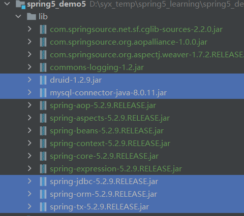
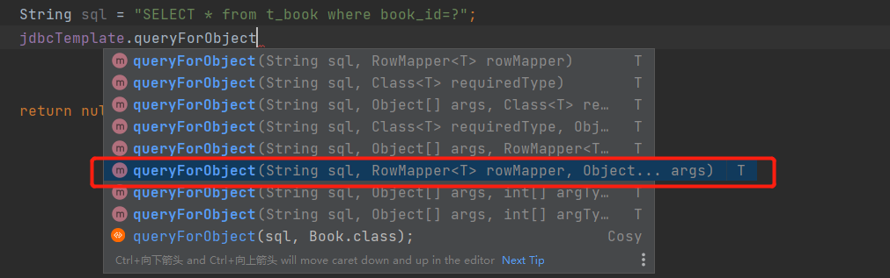

# JdbcTemplate

# 概述

>   1.  JdbcTemplate：
>
>       Spring框架对JDBC进行封装，使用JdbcTemplate方便实现对数据库操作
>
>   2.  准备工作
>
>       ①引入相关jar依赖
>
>       
>
>       ②spring配置文件配置数据库连接池
>
>       ```xml
>       <!--数据库连接池-->
>       <context:property-placeholder location="classpath:jdbc.properties"/>
>       <bean id="druidDataSource" class="com.alibaba.druid.pool.DruidDataSource">
>          <property name="driverClassName" value="${prop.driverClass}"/>
>          <property name="url" value="${prop.url}"/>
>          <property name="username" value="${prop.username}"/>
>          <property name="password" value="${prop.password}"/>
>       </bean>
>       ```
>
>       ```properties
>       prop.driverClass=com.mysql.jdbc.Driver
>       prop.url=jdbc:mysql://localhost:3306/userDB
>       prop.username=root
>       prop.password=123456
>       ```
>
>       ③配置JdbcTemplate对象，注入DateSource
>
>       ```xml
>       <!--JdbcTemplate对象-->
>       <bean id="jdbcTemplate" class="org.springframework.jdbc.core.JdbcTemplate">
>          <!--注入dataSource对象-->
>          <property name="dataSource" ref="druidDataSource">
>          </property>
>       </bean>
>       ```
>
>       ④分别创建创建一个Service、Dao类，在dao注入jdbcTemplate对象
>
>       ```xml
>       <!--开启组件扫描-->
>       <context:component-scan base-package="com.shaoyx.spring5"> 
>       </context:component-scan>
>       ```
>
>       ```java
>       @Service
>       public class BookService {
>           /**
>            * 注入dao
>            */
>           @Autowired
>           private BookDao bookDao;
>               
>       }
>       ```
>
>       ```java
>       @Repository
>       public class BookDaoImpl implements BookDao {
>           
>           /**
>            * 注入JdbcTemplate
>            */
>           @Autowired
>           private JdbcTemplate jdbcTemplate;
>       }
>       ```
>
>       ```java
>       public interface BookDao {
>           
>       }
>       ```


# 操作数据库


>   1.  创建数据库实体类
>
>       ```java
>       public class User {
>
>           private String userID;
>           private String username;
>           private String userStatus;
>
>           public String getUserID() {
>               return userID;
>           }
>
>           public void setUserID(String userID) {
>               this.userID = userID;
>           }
>
>           public String getUsername() {
>               return username;
>           }
>
>           public void setUsername(String username) {
>               this.username = username;
>           }
>
>           public String getUserStatus() {
>               return userStatus;
>           }
>
>           public void setUserStatus(String userStatus) {
>               this.userStatus = userStatus;
>           }
>       }
>       ```
>
>   2.  编写service和dao
>
>       以下为增删改逻辑
>
>       ```java
>       @Repository
>       public class BookDaoImpl implements BookDao {
>       
>           /**
>            * 注入JdbcTemplate
>            */
>           private final JdbcTemplate jdbcTemplate;
>       
>           public BookDaoImpl(JdbcTemplate jdbcTemplate) {
>               this.jdbcTemplate = jdbcTemplate;
>           }
>       
>           @Override
>           public void add(Book book) {
>               String sql = "insert into t_book values(?,?,?)";
>               int update = jdbcTemplate.update(sql, book.getBookid(), book.getBookName(), book.getBookStatus());
>               System.out.println(update);
>           }
>       
>           @Override
>           public void update(Book book) {
>               String sql = "update t_book set book_name=?,book_status=? where book_id=?";
>               int update = jdbcTemplate.update(sql, book.getBookName(), book.getBookStatus(), book.getBookid());
>               System.out.println(update);
>           }
>       
>           @Override
>           public void delete(String bookId) {
>               String sql = "delete  from t_book where book_id=?";
>               int update = jdbcTemplate.update(sql, bookId);
>               System.out.println(update);
>           }
>       }
>       ```
>
>       ```java
>       public interface BookDao {
>       
>           void add(Book book);
>       
>           void update(Book book);
>       
>           void delete(String book);
>       }
>       ```
>
>       ```java
>       @Service
>       public class BookService {
>           /**
>            * 注入dao
>            */
>           @Autowired
>           private BookDao bookDao;
>       
>           /**
>            * 新增
>            * @param book book
>            */
>           public void addBook(Book book) {
>               bookDao.add(book);
>           }
>         
>           /**
>            * 修改
>            * @param book book
>            */
>           public void updateBook(Book book) {
>               bookDao.update(book);
>           }
>       
>           /**
>            * 删除
>            * @param bookId bookId
>            */
>           public void deleteBook(String bookId) {
>               bookDao.delete(bookId);
>           }
>       }
>       ```
>
>   3.  查询返回某个值
>
>       查询表里有多少条记录
>
>       ```java
>       @Repository
>       public class BookDaoImpl implements BookDao {
>         /**
>          * 查询表中的记录数
>          */
>         @Override
>         public int selectCount() {
>             String sql = "SELECT COUNT(*) FROM t_book";
>             Integer count = jdbcTemplate.queryForObject(sql, Integer.class);
>             return count;
>         }
>       }
>       ```
>
>   4.  查询返回对象
>
>       查询图书详情
>
>       
>
>       ①sql：sql语句
>
>       ②RowMapper：是接口，返回不同类型的数据，使用这个接口实现类完成数据封装
>
>       ③args：sql语句值
>
>       ```java
>       @Repository
>       public class BookDaoImpl implements BookDao {
>         /**
>          * 查询返回对象by id
>          */
>         @Override
>         public Book findBookInfoById(String id) {
>             String sql = "SELECT * from t_book where book_id=?";
>             return jdbcTemplate.queryForObject(sql, new BeanPropertyRowMapper<>(Book.class), id);
>         }
>       }
>       ```
>
>   5.  查询返回集合
>
>       查询图书分页
>
>       
>
>       ```java
>       @Repository
>       public class BookDaoImpl implements BookDao {
>       		/**
>            * 所有图书信息
>            *
>            * @return List<Book>
>            */
>           @Override
>           public List<Book> findAllBook() {
>               String sql = "select * from t_book";
>               return jdbcTemplate.query(sql, new BeanPropertyRowMapper<>(Book.class));
>           }
>       }
>       ```
>
>   6.  批量操作
>
>       批量添加、修改、删除(修改，删除同理)
>
>       
>
>       ①sql：Sql语句
>
>       ②batchArgs：List集合，添加多条记录数据
>
>       ```java
>       @Repository
>       public class BookDaoImpl implements BookDao {
>         
>           /**
>            * 批量添加
>            *
>            * @param batchArgs 批量数据
>            */
>           @Override
>           public void batchAddBook(List<Object[]> batchArgs) {
>               String sql = "insert into t_book values(?,?,?)";
>       
>               int[] ints = jdbcTemplate.batchUpdate(sql, batchArgs);
>               System.out.println(Arrays.toString(ints));
>           }
>       
>           /**
>            * 批量修改
>            *
>            * @param batchArgs 批量修改数据
>            */
>           @Override
>           public void batchUpdateBook(List<Object[]> batchArgs) {
>               String sql = "update t_book set book_name=?,book_status=? where book_id=?";
>               int[] ints = jdbcTemplate.batchUpdate(sql, batchArgs);
>               System.out.println(Arrays.toString(ints));
>           }
>       
>           /**
>            * 批量删除
>            *
>            * @param batchArgs 批量删除Id
>            */
>           @Override
>           public void batchDeleteBook(List<Object[]> batchArgs) {
>               String sql = "delete  from t_book where book_id=?";
>               int[] ints = jdbcTemplate.batchUpdate(sql, batchArgs);
>               System.out.println(Arrays.toString(ints));
>           }
>       }
>       
>       ```
>