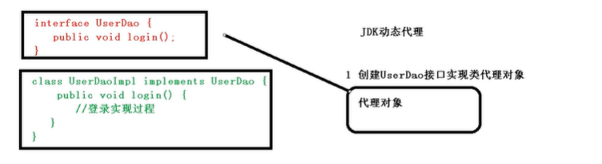
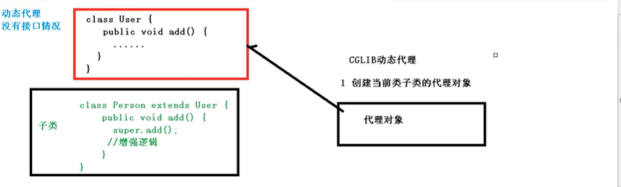
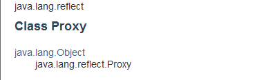
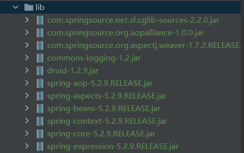
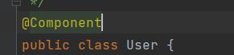
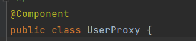
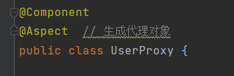

# AOP


# 概述

>    面向切面编程，利用AOP可以对业务逻辑的哥哥部分进行隔离，从而使得业务逻辑各部分之间的耦合度降低，提高程序的可重用性，同时提高了开发的效率。
>
>   不通过修改源代码的方式，在主干功能里面添加新功能

# 底层原理

>   AOP底层使用动态代理，有两种动态代理。第一，有接口情况，使用JDK动态代理；第二，无接口情况，使用CGLIB动态代理
>
>   
>
>   
>
>   
>
>   
>
>   

# JDK动态代理

## 动态代理

>   使用JDK动态代理，使用Proxy类里面的方法创建代理对象
>   

>   调用newProxyInstance方法

```java
static Object newProxyInstance(ClassLoader loader, 类<?>[] interfaces, InvocationHandler h)
// 返回指定接口的代理类的实例，该接口将方法调用分派给指定的调用处理程序。 
```

>   参数：
>
>   1.  ClassLoader loader：类加载器
>   2.  类<?>[] interfaces ：增强方法所在的类，这个类实现的接口，支持多个接口
>   3.  InvocationHandler h：实现这个接口InvocationHandler，创建代理对象，写增强的方法


## JDK动态代理代码

1.  创建接口，定义方法

    ```java
    public interface UserDao {
    
        public int add(int a, int b);
    
        public void update(String id);
    }
    ```

2.  创建接口实现类，实现方法

    ```java
    public class UserDaoImpl implements UserDao {
    
        @Override
        public int add(int a, int b) {
            return a + b;
        }
    
        @Override
        public String update(String id) {
            return id;
        }
    }
    ```

3.  使用Proxy类创建接口代理对象

    ```java
    public class JDKProxy {
    
        public static void main(String[] args) {
            //    创建接口实现类代理对象
            Class[] interfaces = {UserDao.class};
            UserDaoImpl userDao = new UserDaoImpl();
            UserDao dao = (UserDao) Proxy.newProxyInstance(JDKProxy.class.getClassLoader(), interfaces, new UserDaoProxy(userDao));
            int result = dao.add(1, 2);
            System.out.println("result:" + result);
        }
    }
    
    /**
     * 创建代理对象代码
     */
    class UserDaoProxy implements InvocationHandler {
        private Object obj;
    
        // 1.把创建的类的代理对象，把该对象传递进来
        // 有参数的构造
        public UserDaoProxy(Object obj) {
            this.obj = obj;
        }
    
        //增强的逻辑
        @Override
        public Object invoke(Object proxy, Method method, Object[] args) throws Throwable {
            // 方法之前处理
            System.out.println("方法之前执行..." + method.getName() + ":传递的参数" + Arrays.toString(args));
            // 被增强的方法执行
            Object res = method.invoke(obj, args);
            // 方法之后处理
            System.out.println("方法之后执行..." + obj + "");
            return res;
        }
    }
    ```

# AOP术语

1.  连接点

    >   类里支持被增强的方法称为连接点

2.  切入点

    >   实际增强的方法，称为切入点

3.  通知（增强）

    >   实际增强的逻辑部分称为通知
    >
    >   通知有多种类型
    >
    >   1.  前置通知
    >   2.  后置通知
    >   3.  环绕通知
    >   4.  异常通知
    >   5.  最终通知

4.  切面

    >   把通知应用到切入点的过程


# 准备工作

1.  Spring框架中一般基于AspectJ实现AOP操作

    >   AspectJ：不是SPring组成部分，独立AOP框架，一般把AspectJ和Spring框架一起使用，进行AOP操作

2.  基于AspectJ实现AOP操作

    >   1.  基于XML配置文件实现
    >   2.  基于注解方式实现（*）

3.  在项目中引入AOP相关依赖

    

4.  切入点的表达式

    ①作用：明确增强的方法

    ②语法结构：

    ```java
    execution([权限修饰符] [返回类型] [类全路径] [方法名称] )
    ```

    例如：

    >   Ⅰ 对com.shaoyx.spring5.BookDao类里面的add方法进行增强

    ```java
    execution( * com.shaoyx.spring5.BookDao.add(..))
    ```

    >   Ⅱ 对com.shaoyx.spring5.BookDao类里面的所有方法进行增强

    ```java
    execution( * com.shaoyx.spring5.BookDao.*(..))
    ```

    >   Ⅲ 对com.shaoyx.spring5包里所有类，类里面所有方法进行增强

    ```java
    execution( * com.shaoyx.spring5.*(..))
    ```

    

# AspectJ注解

1.  创建类，在类里面定义方法

    ```java
    public class User {
        public void add() {
            System.out.println("add...");
        }
    }
    ```

2.  创建增强类，编写增强逻辑

    >   在增强类里面，创建方法，让不同方法代表不同通知类型

    ```java
    public class UserProxy {
    
        /**
         * 前置通知
         */
        public void before() {
            System.out.println("before ...");
        }
        
    ```

3.  进行通知的配置

    ①在spring配置文件中，开启注解扫描

    ```xml
    <?xml version="1.0" encoding="UTF-8"?>
    <beans xmlns="http://www.springframework.org/schema/beans"
           xmlns:xsi="http://www.w3.org/2001/XMLSchema-instance"
           xmlns:context="http://www.springframework.org/schema/context"
           xmlns:aop="http://www.springframework.org/schema/aop"
           xsi:schemaLocation="
           http://www.springframework.org/schema/beans http://www.springframework.org/schema/beans/spring-beans.xsd
           http://www.springframework.org/schema/context http://www.springframework.org/schema/context/spring-context.xsd
           http://www.springframework.org/schema/aop http://www.springframework.org/schema/aop/spring-aop.xsd
    ">
       
       <!--开启注解扫描-->
       <context:component-scan base-package="com.shaoyx.spring5.aopanno">
       </context:component-scan>
    </beans>
    ```

    ②使用注解创建User和UserProxy对象

    

    

    ③在增强类上面添加注解@Aspect

    

    ④在spring配置文件中开启生成对象

    ```xml
    <!--开启Aspect生成代理对象-->
    <aop:aspectj-autoproxy></aop:aspectj-autoproxy>
    ```

4.  配置不同类型的通知

    >   ①在增强类的里面，在座位通知方法上面添加通知类型注解，使用切入点表达式配置

    ```java
    @Component
    @Aspect  // 生成代理对象
    public class UserProxy {
        /**
         * 前置通知
         * Before 注解表示作为前置通知
         */
        @Before(value = "execution(* com.shaoyx.spring5.aopanno.User.add(..))")
        public void before() {
            System.out.println("before ...");
        }
    
        /**
         * 最终通知
         */
        @After(value = "execution(* com.shaoyx.spring5.aopanno.User.add(..))")
        public void after() {
            System.out.println("after ...");
        }
    
        /**
         * 后置通知（返回通知）
         */
        @AfterReturning(value = "execution(* com.shaoyx.spring5.aopanno.User.add(..))")
        public void afterReturning() {
            System.out.println("afterReturning ...");
        }
    
        /**
         * 异常通知
         */
        @AfterThrowing(value = "execution(* com.shaoyx.spring5.aopanno.User.add(..))")
        public void afterThrowing() {
            System.out.println("afterThrowing ...");
        }
    
        /**
         * 环绕通知,z在程序执行前后都进行处理
         */
        @Around(value = "execution(* com.shaoyx.spring5.aopanno.User.add(..))")
        public void around(ProceedingJoinPoint proceedingJoinPoint) throws Throwable {
            System.out.println("around before...");
            // 被增强的方法执行
            proceedingJoinPoint.proceed();
            System.out.println("around after ...");
    
        }
    
    }
    
    ```

    因spring版本更换，通知顺序改变，spring5.2.9版本执行顺序如下：

    ```shell
    around before ...
    before ...
    add ...
    afterReturning ...
    after ...
    around after ...
    ```

5.  相同的切入点抽取

    ```java
    @Component
    @Aspect  // 生成代理对象
    public class UserProxy {
    
        /**
         * 抽取相同切入点
         */
        @Pointcut(value = "execution(* com.shaoyx.spring5.aopanno.User.add(..))")
        public void pointDemo() {
        }
    
        /**
         * 前置通知
         * Before 注解表示作为前置通知
         */
        @Before(value = "pointDemo()")
        public void before() {
            System.out.println("before ...");
        }
      
         /**
         * 最终通知
         */
        @After(value = "pointDemo()")
        public void after() {
            System.out.println("after ...");
        }
    
    }
    ```

6.  多个增强类同一个方法进行增强，设置增强类优先级

    >   在增强类上面添加注解@Order( [数字类型的值] ),数字越小，有限制越高

    ```java
    @Component
    @Aspect  // 生成代理对象
    @Order(300)
    public class UserProxy {
    }
    
    @Component
    @Aspect
    @Order(100)
    public class PersonProxy {}
    ```

    

# AspectJ配置文件

>   创建两个类

