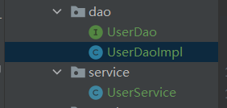

# IOC

# IOC操作Bean管理

## 基于xml方式创建对象

```xml
<bean id="user" class="com.shaoyx.spring5.User"></bean>
```

1. 在spring配置文件中，使用bean标签，标签里面添加对应属性，就可以实现对象创建
2. 在bean标签有很多属性，常见属性如下：
   - id：唯一标识
   - class：类的全路径（包类路径）
3. 创建对象时，默认也是执行无参构造方法

### 基于xml方式注入属性

**使用set方法进行注入**

*Book.java*

```java
public class Book {
    private String bookName;
    
    public Book() {
    }
    
    public void setBookName(String bookName) {
        this.bookName = bookName;
    }
    
    public void testDemo() {
        System.out.println(bookName + "::" + bookAuthor);
    }
}
```

*bean1.xml*

```xml
<bean id="book" class="com.shaoyx.spring5.Book">
    <!--使用property完成属性注入
        name:类里面的属性名称
        value:向属性注入值-->
    <property name="bookName" value="本草科目"></property>
    <property name="bookAuthor" value="李时珍"></property>
</bean>
```

*TestSpring5Test.java*

```java
public class TestSpring5Test {
    
    @Test
    public void testBook1() {
        ApplicationContext context = new ClassPathXmlApplicationContext("bean1.xml");
        Book book = context.getBean("book1", Book.class);
        System.out.println(book);
        book.testDemo();        
    }
}
```

### 有参构造注入

*Orders.java*

```java
public class Orders {
    private String ordersName;
    private String address;


    public Orders(String ordersName, String address) {
        this.ordersName = ordersName;
        this.address = address;
    }

    public void ordersTest() {
        System.out.println(ordersName + "::" + address);
    }
}
```

*bean1.xml*

```xml
<!--    3.使用有参构造注入属性-->
<bean id="orders" class="com.shaoyx.spring5.Orders">
    <constructor-arg name="ordersName" value="电脑"></constructor-arg>
    <constructor-arg name="address" value="China"></constructor-arg>
</bean>
```

*TestSpring5Test.java*

```java
public class TestSpring5Test {
    @Test
    public void testOrders() {
        ApplicationContext context = new ClassPathXmlApplicationContext("bean1.xml");
        Orders orders = context.getBean("orders", Orders.class);

        System.out.println(orders);
        orders.ordersTest();
    }
}
```
### 	P名称空间注入（了解）

使用p名称空间注入，可以简化基于xml配置方式

1.  添加p名称空间在配置文件中

    ```xml
    <beans 
       xmlns="http://www.springframework.org/schema/beans"
               xmlns:xsi="http://www.w3.org/2001/XMLSchema-instance"
               xmlns:p="http://www.springframework.org/schema/p"
               xsi:schemaLocation="http://www.springframework.org/schema/beans 	http://www.springframework.org/schema/beans/spring-beans.xsd">
    </beans>
    ```

2.  进行属性注入，在beanb标签里

    ```xml
    <bean id="book2" class="com.shaoyx.spring5.Book" p:bookName="九阳神功" p:bookAuthor="ysx">
    </bean>
    ```


### 基于XML注入其他类型属性

字面量：

1.  null值

    ```xml
    <bean id="book1" class="com.shaoyx.spring5.Book">
       <property name="bookName" value="本草科目"/>
       <property name="bookAuthor" value="李时珍"/>
       <!--设置空值null-->
       <property name="address">
          <null/>
       </property>
    </bean>
    ```

2.  属性值包含特殊符号

    ```xml
    <bean id="book3" class="com.shaoyx.spring5.Book">
       <property name="bookName" value="本草科目"/>
       <property name="bookAuthor" value="李时珍"/>
       <!--属性包含特殊符号
          1.把 <> 转义 &lt;   &gt;
          2.把带特殊符号内容写道CDATA
       -->
       <property name="address">
          <value><![CDATA[<<南京>>]]></value>
       </property>
    </bean>
    ```

### **注入属性-外部bean**

1.  创建两个类:service类和dao类

    

    ```java
    public interface UserDao {
        public void update();
    }
    
    public class UserDaoImpl implements UserDao {
    
        @Override
        public void update() {
            System.out.println("dao update ...");
        }
    }
    
    public class UserService {
    
        public void add() {
            System.out.println("service add ...");
        }
    }
    ```

2.  在service调用dao里面的方法

    ```java
    public class UserService {
    
        // 创建UserDao类属性，生成set方法
        private UserDao userDao;
    
        public void setUserDao(UserDao userDao) {
            this.userDao = userDao;
        }
    
        public void add() {
            System.out.println("service add ...");
            userDao.update();
        }
    }
    ```

3.  在spring配置文件进行配置

    ```xml
    <!--1.service和dao对象创建-->
    <bean id="userService" class="com.shaoyx.spring5.service.UserService">
       <!--注入userDao对象
          name：类里面属性名称
          ref：创建userDao对象bean标签的id值
       -->
       <property name="userDao" ref="UserDaoImpl">
       </property>
    </bean>
    <bean id="UserDaoImpl" class="com.shaoyx.spring5.dao.UserDaoImpl">
    </bean>
    ```

4.  测试

    ```java
    public class BeanTest {
        @Test
        public void test() {
            ApplicationContext context = new ClassPathXmlApplicationContext("bean2.xml");
            UserService userService = context.getBean("userService", UserService.class);
            userService.add();
        }
    }
    ```

### 注入属性-内部bean和级联赋值

1.  一对多关系：部门和员工

    ```java
    // 部门
    public class Dept {
        private String deptName;
    
        public void setDeptName(String deptName) {
            this.deptName = deptName;
        }
    
        @Override
        public String toString() {
            return String.format("'%s'", deptName);
        }
    }
    
    // 员工
    public class Emp {
        private String empName;
        private String empGender;
    
    
    
        public void setEmpName(String empName) {
            this.empName = empName;
        }
    
        public void setEmpGender(String empGender) {
            this.empGender = empGender;
        }
    
    }
    
    ```

2.  在实体类之间表示一对多关系

    ```java
    // 员工
    public class Emp {
        private String empName;
        private String empGender;
    
        /**
         * 员工属于某一个部门，使用对象表示
         */
        private Dept dept;
        
        public Dept getDept() {
            return dept;
        }
        public void setDept(Dept dept) {
            this.dept = dept;
        }
    
        public void setEmpName(String empName) {
            this.empName = empName;
        }
    
        public void setEmpGender(String empGender) {
            this.empGender = empGender;
        }
    
        @Override
        public String toString() {
            return "Emp{" +
                    "empName='" + empName + '\'' +
                    ", empGender='" + empGender + '\'' +
                    ", dept=" + dept +
                    '}';
        }
    }
    ```

3.  在spring配置文件进行配置

    ```xml
    <!--内部bean-->
    <bean id="emp" class="com.shaoyx.spring5.bean.Emp">
       <!--先设置两个普通属性-->
       <property name="empName" value="lucy">
       </property>
       <property name="empGender" value="女">
       </property>
       <!--设置对象属性 -->
       <property name="dept">
          <bean id="dept" class="com.shaoyx.spring5.bean.Dept">
             <property name="deptName" value="开发部">
             </property>
          </bean>
       </property>
    </bean>
    ```

注入属性-级联赋值

1.  第一种方式

    ```xml
    <!--级联赋值-->
    <bean id="emp" class="com.shaoyx.spring5.bean.Emp">
       <!--先设置两个普通属性-->
       <property name="empName" value="lucy">
       </property>
       <property name="empGender" value="女">
       </property>
       <property name="dept" ref="dept">
       </property>
    </bean>
    <bean id="dept" class="com.shaoyx.spring5.bean.Dept">
       <property name="deptName" value="财务部">
       </property>
    </bean>
    ```

2.  第二种方式

    ```xml
    <!--级联赋值-->
    <bean id="emp" class="com.shaoyx.spring5.bean.Emp">
       <!--先设置两个普通属性-->
       <property name="empName" value="lucy"></property>
       <property name="empGender" value="女"></property>
        <!--此方法需要在emp中生成getDept方法-->
       <property name="dept.deptName" value="技术部">   </property>
    </bean>
    <bean id="dept" class="com.shaoyx.spring5.bean.Dept">
       <property name="deptName" value="财务部"></property>
    </bean>
    ```


### 基于XML注入集合属性

-   注入数组类型属性
-   注入List集合类型属性
-   注入Map集合
-   注入Set集合

1.  创建类，定义属性：数组，List，Map，Set类型

    ```java
    public class Student {
    
        private String[] courses;
    
        private List<String> list;
    
        private Map<String, String> map;
    
        private Set<String> sets;
    
        public void setSets(Set<String> sets) {
            this.sets = sets;
        }
    
        public Student() {
        }
    
        public void setList(List<String> list) {
            this.list = list;
        }
    
        public void setMap(Map<String, String> map) {
            this.map = map;
        }
    
        public void setCourses(String[] courses) {
            this.courses = courses;
        }
    
        @Override
        public String toString() {
            return "Student{" +
                    "courses=" + Arrays.toString(courses) +
                    ", list=" + list +
                    ", map=" + map +
                    ", sets=" + sets +
                    '}';
        }
    }
    ```

2.  在spring配置文件中进行配置

    ```xml
    <!--集合类型属性注入-->
    <bean id="student" class="com.shaoyx.spring5.collectiontype.Student">
       <!--数组类型属性注入-->
       <property name="courses">
          <array>
             <value>数据分析</value>
             <value>机器学习</value>
          </array>
       </property>
       <!--List类型属性注入-->
       <property name="list">
          <list>
             <value>张三丰</value>
             <value>刘广延</value>
          </list>
       </property>
       <!--List类型属性注入-->
       <property name="map">
          <map>
             <entry key="JAVA" value="Java"></entry>
             <entry key="PYTHON" value="Python"></entry>
          </map>
       </property>
       <!--Set类型属性注入-->
       <property name="sets">
          <set>
             <value>MySQL</value>
             <value>Redis</value>
          </set>
       </property>
    </bean>
    ```

### 在集合里面设置对象类型值

```xml
<bean id="student" class="com.shaoyx.spring5.collectiontype.Student">
    <!--注入List集合类型，值是对象-->
       <property name="courseList">
          <list>
             <ref bean="course1"/>
             <ref bean="course2"/>
          </list>
       </property>
    </bean>
    <!--创建多个course对象-->
    <bean id="course1" class="com.shaoyx.spring5.collectiontype.Course">
       <property name="courseName" value="JAVA">
       </property>
</bean>
<bean id="course2" class="com.shaoyx.spring5.collectiontype.Course">
   <property name="courseName" value="Python">
   </property>
</bean>
```

```java
public class Student {


    /**
     * 学生所学多门课程
     */
    private List<Course> courseList;

    public void setCourseList(List<Course> courseList) {
        this.courseList = courseList;
    }

   
}
```


### 把集合注入部分提取出来

1.  在spring配置文件中引入名称空间util，

    ```xml
    <beans xmlns="http://www.springframework.org/schema/beans"
           xmlns:xsi="http://www.w3.org/2001/XMLSchema-instance"
           xmlns:p="http://www.springframework.org/schema/p"
           xmlns:util="http://www.springframework.org/schema/util"
    
           xsi:schemaLocation="http://www.springframework.org/schema/beans http://www.springframework.org/schema/beans/spring-beans.xsd
                               http://www.springframework.org/schema/util http://www.springframework.org/schema/util/spring-util.xsd">
    
    </beans>
    ```

2.  使用util标签完成list集合注入提取

```xml
<!--提取list集合类型属性注入-->
<util:list id="bookList">
   <value>高等代数</value>
   <value>数学分析</value>
   <value>机器学习</value>
</util:list>
<!--提取list集合类型属性注入使用-->
<bean id="book" class="com.shaoyx.spring5.collectiontype.Book">
   <property name="list" ref="bookList"/>
   
</bean>
```

### FactoryBean

>   1.  Spring有两中国类型bean，一种普通bean，另外一种工厂bean（FactoryBean）
>   2.  普通bean：在配置文件中定义的bean类型就是返回类型
>   3.  工厂bean：在配置文件中定义的bean类型可以与返回类型不一致

1.  创建类，让这个类作为工厂bean,实现接口FactoryBean

2.  实现接口里面的方法，在实现的方法中定义返回的bean类型

    ```java
    public class MyBean implements FactoryBean<Course> {
    
        /**
         * 定义返回bean
         *
         * @return course
         */
        @Override
        public Course getObject() throws Exception {
            Course course = new Course();
            course.setCourseName("abs");
            return course;
        }
    
        @Override
        public Class<?> getObjectType() {
            return null;
        }
    
        @Override
        public boolean isSingleton() {
            return FactoryBean.super.isSingleton();
        }
    }
    ```

    ```java
    @Test
    public void test3() {
        ApplicationContext context = new ClassPathXmlApplicationContext("bean3.xml");
        Course course = context.getBean("myBean", Course.class);
        System.out.println(course);
    }
    ```

    ```xml
    <bean id="myBean" class="com.shaoyx.spring5.factorybean.MyBean">
    
    </bean>
    ```


### bean的作用域

>   1.  在spring里面，设置创建bean实例还是多实例
>   2.  在spring里面，默认情况下，bean是单实例对象
>   3.  可设置为单实例或多实例

设置单实例或多实例

1.  在spring配置文件bean标签里面有属性scope，用于设置单实例或多实例

2.  scope属性值：

    ①singleton，默认值，表示单实例对象
    ②prototype，表示多实例对象

    ```xml
    <bean id="book" class="com.shaoyx.spring5.collectiontype.Book" scope="prototype">
       <property name="list" ref="bookList"/>
    </bean>
    ```

    

### bean的生命周期

>   1.  生命周期：从对象创建到对象销毁的过程
>   2.  过程：
>       ①通过构造器创建bean实例（无参数构造）
>       ②为bean的属性设置为对其他bean的引用（调用set方法）
>       ③调用bean的初始化的方法（需要进行配置初始化的方法）
>       ④bean可以使用了（对象获取到了）
>       ⑤当容器关闭的时候，调用bean的销毁的方法（需要配置销毁的方法）
>   3.  后置处理器
>       ①通过构造器创建bean实例（无参数构造）
>       ②为bean的属性设置为对其他bean的引用（调用set方法）
>       ③把bean实例传递bean后置处理的方法
>       ④调用bean的初始化的方法（需要进行配置初始化的方法）
>       ⑤把bean实例传递bean后置处理的方法
>       ⑥bean可以使用了（对象获取到了）
>       ⑦当容器关闭的时候，调用bean的销毁的方法（需要配置销毁的方法）

1.  一般过程

    ```java
    public class Orders {
        private String ordersName;
    
        public Orders() {
            System.out.println("第一步 执行无参构造创建bean实例");
        }
    
        public void setOrdersName(String ordersName) {
            this.ordersName = ordersName;
            System.out.println("第二部 调用set方法设置值");
        }
    
        /**
         * 创建执行的初始化的方法,方法名可自定义
         */
        public void initMethod() {
            System.out.println("第三步 执行初始化方法");
        }
    
        /**
         * 创建执行的销毁的方法,方法名可自定义
         */
        public void destroyMethod() {
            System.out.println("第五步 执行销毁方法");
        }
    }
    ```

    ```xml
    <bean id="orders" class="com.shaoyx.spring5.bean.Orders" init-method="initMethod" destroy-method="destroyMethod">
       <property name="ordersName" value="手机">
       
       </property>
    </bean>
    ```

    ```java
    @Test
    public void testBean3() {
        ClassPathXmlApplicationContext context = new ClassPathXmlApplicationContext("bean4.xml");
        Orders orders = context.getBean("orders", Orders.class);
        System.out.println("第四步 获取到bean实例对象");
        System.out.println(orders);
        // 手动调用销毁方法
        context.close();
    }
    ```

2.  后置处理器

    >   1.  创建类，实现接口BeanPostProcessor，创建后置处理器

    ```java
    public class MyBeanPost implements BeanPostProcessor {
        @Override
        public Object postProcessBeforeInitialization(Object bean, String beanName) throws BeansException {
            System.out.println("在初始化之前执行的方法");
            return bean;
        }
    
        @Override
        public Object postProcessAfterInitialization(Object bean, String beanName) throws BeansException {
            System.out.println("在初始化之后执行的方法");
            return bean;
        }
    }
    ```

    ```xml
    <!--配置后置处理器-->
    <bean id="myBeanPost" class="com.shaoyx.spring5.bean.MyBeanPost">
    
    </bean>
    ```

### XML自动装配

>   自动装配：根据指定装配规则（属性名称或者属性类型），spring自动匹配的属性值进行注入

```xml
<!--实现自动装配
   bean标签属性autowire,配置自动装配
   autowire属性常用两个值：
      byName根据属性名称注入,注入值bean的id值和类属性名称一致
      byType根据类型注入
-->
<bean id="emp" class="com.shaoyx.spring5.autowire.Emp" autowire="byName">
   <!--<property name="dept" ref="dept"></property>-->

</bean>
```

### 外部属性文件

>   1.  直接配置数据库信息
>
>       ①配置德鲁伊连接池
>       ②引入德鲁伊连接池jar包
>
>       ```xml
>       <bean id="druidDataSource" class="com.alibaba.druid.pool.DruidDataSource">
>          <property name="driverClassName" value="com.mysql.jdbc.Driver"></property>
>          <property name="url" value="jdbc:mysql://localhost:3306/userDB"></property>
>          <property name="username" value="root"></property>
>          <property name="password" value="$123456"></property>
>       </bean>
>       ```
>
>   2.  引入外部属性文件配置数据库连接池
>
>       ①创建外部属性文件，properties格式文件，填写数据库信息
>
>       ```properties
>       prop.driverClass=com.mysql.jdbc.Driver
>       prop.url=jdbc:mysql://localhost:3306/userDB
>       prop.username=root
>       prop.password=123456
>       ```
>
>       ②把外部properties属性文件引入到spring配置文件中
>       引入context名称空间
>
>       ```xml
>       <beans xmlns="http://www.springframework.org/schema/beans"
>              xmlns:xsi="http://www.w3.org/2001/XMLSchema-instance"
>              xmlns:p="http://www.springframework.org/schema/p"
>              xmlns:util="http://www.springframework.org/schema/util"
>              xmlns:context="http://www.springframework.org/schema/context"
>       
>              xsi:schemaLocation="http://www.springframework.org/schema/beans http://www.springframework.org/schema/beans/spring-beans.xsd
>                                  http://www.springframework.org/schema/util http://www.springframework.org/schema/util/spring-util.xsd
>                                  http://www.springframework.org/schema/context http://www.springframework.org/schema/context/spring-context.xsd">
>       </beans>
>       ```
>
>       在spring 配置文件使用标签引入外部属性文件
>
>       


## 基于注解方式实现

>   1.  注解是代码特殊标记，格式：@注解名称(属性名称=属性值，属性名称=属性值…)
>   2.  使用注解，注解可以使用在类、方法、属性上面
>   3.  目的：简化xml配置


>   Spring针对Bean管理中创建对象提供注解
>
>   1.  @Component
>   2.  @Service
>   3.  @Controller
>   4.  @Repository

### 基于注解方式实现对象创建

>   1.  引入jar依赖
>       spring-aop-5.2.1.RELEASE.jar
>
>   2.  开启组件扫描
>
>       ```xml
>       <!--开启组件扫描
>          1.如果扫描多个包，多个包使用都好隔开
>          2.扫描上层目录即可开启该目录下所有的包
>       -->
>       <context:component-scan base-package="com.shaoyx.spring5">
>       </context:component-scan>
>       ```
>
>   3.  创建类，在类上面创建对象注解
>
>       ```java
>       // 在注解里面value属性值可以省略不写
>       // 默认值是类名称，首字母小写
>       // UserService -- userService
>       @Component(value = "userService") //<bean id="userService" />
>       public class UserService {
>           public void add() {
>               System.out.println("service add ...");
>           }
>       
>       }
>       ```
>
>   4.  开启组件扫描细节配置
>
>       ```xml
>       <!--实例1
>          use-default-filters="false" 表示不使用默认filter，使用自定义filter
>       -->
>       <context:component-scan base-package="com.shaoyx.spring5" use-default-filters="false">
>          <context:include-filter type="annotation" expression="org.springframework.stereotype.Controller"/>
>       </context:component-scan>
>       
>       <!--示例2
>          下面扫描包所有内容
>          context:exclude-filter 设置那些内容不扫描
>       -->
>       <context:component-scan base-package="com.shaoyx.spring5">
>          <context:exclude-filter type="annotation" expression="org.springframework.stereotype.Controller"/>
>       </context:component-scan>
>       ```
>
>   5.  基于注解方式实现属性注入
>
>       >   1.  @AutoWired：根据属性类型自动装配
>       >   2.  @Qualifier：根绝属性名称进行注入,需要与@AutoWired一起使用
>       >   3.  @Resource：可以根据类型注入，也可以根据名称注入
>       >   4.  @Value：注入普通类型属性
>
>       (1)@AutoWired
>
>       ①把service和dao对象创建，在service和dao类中添加创建对象注解
>
>       ②在service注入dao对象，在service类添加dao类型属性，在属性上面使用注解j
>
>       ```java
>       public interface  UserDao {
>           public void add() ;
>       }
>       
>       @Repository
>       public class UserDaoImpl implements UserDao {
>           @Override
>           public void add() {
>               System.out.println("dao add...");
>           }
>       }
>       
>       public class UserService {
>       
>           /**
>            * 定义dao类型属性
>            * 不需要添加set方法
>            * 添加注入属性的注解即可
>            */
>           @Autowired // 根据类型注入
>           private UserDao userDao;
>       
>           public void add() {
>               System.out.println("service add ...");
>               userDao.add();
>           }
>       
>       
>       ```
>
>       (2)@Qualifier
>
>       ```java
>       public class UserService {
>       
>           /**
>            * 定义dao类型属性
>            * 不需要添加set方法
>            * 添加注入属性的注解即可
>            */
>           @Autowired // 根据类型注入
>           @Qualifier(value = "userDaoImpl1")  // 根据名称注入
>           private UserDao userDao;
>       
>           public void add() {
>               System.out.println("service add ...");
>               userDao.add();
>           }
>       
>       }
>       ```
>
>       (3)@Resource
>
>       ```java
>       @Resource // 根据类型注入
>       private UserDao userDao1;
>       
>       @Resource(name = "userDaoImpl1") // 根据名称注入
>       private UserDao userDao2;
>       ```
>
>       (4)@Value
>
>       ```java
>       @Value("abs")
>       private String name;
>       ```

### 完全注解开发

>   1.  创建配置类，替代xml配置文件
>
>       ```java
>       import org.springframework.context.annotation.ComponentScan;
>       import org.springframework.context.annotation.Configuration;
>       
>       @Configuration // 作为配置类，替代xml配置文件
>       @ComponentScan(basePackages = {"com.shaoyx.spring5"})
>       public class SpringConfig {
>           
>       }
>       ```
>
>   2.  编写测试类
>
>       ```java
>       @Test
>       public void testService2() {
>           // 加载配置类
>           ApplicationContext context = new AnnotationConfigApplicationContext(SpringConfig.class);
>       
>           UserService userService = context.getBean("userService", UserService.class);
>           System.out.println(userService);
>           userService.add();
>       }
>       ```


